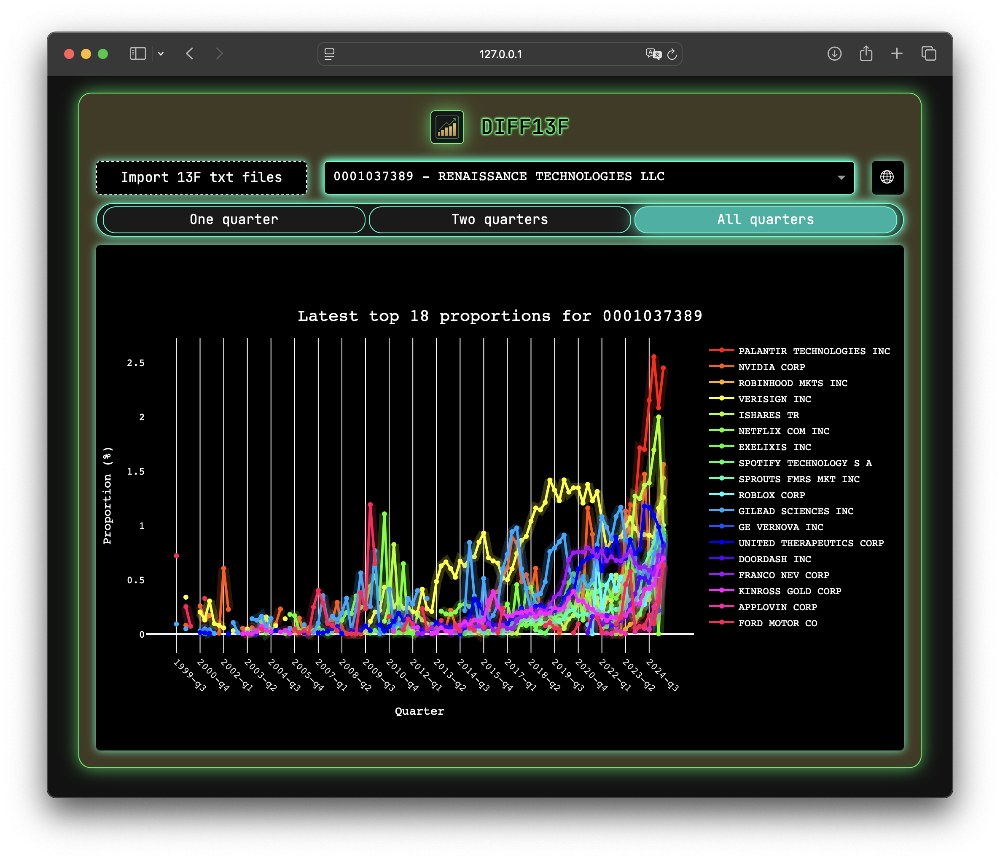

[](./LICENSE)
[]()
[]()

# DIFF13F

*DIFF13F* is a minimal Dash app to explore quarterly 13F filings, view top positions, track changes between quarters, and visualize holdings over time.

## ✨ Features
- 📊 Explore top positions in a single quarter
- 🔍 Spot largest changes between two quarters
- 📈 Track top positions over time with line plots across multiple quarters
- 💻 Minimal web interface powered by Dash

## 🛠️ Installation

Make sure Python 3.9+ is installed with pip.

**Install the `diff13f` library:**
   ```bash
	pip install git+https://github.com/Noe-AC/diff13f.git
   ```
This will add the `diff13f` command to your PATH.

## 🧩 Requirements

**Python libraries (installed automatically via pip):**

- ``dash`` and ``dash-bootstrap-components``: the interactive web interface.
- ``plotly``: for plots.
- ``pandas``: data loading and manipulation.
- ``polars``: optional high-performance DataFrame library.
- ``xmltodict``: parsing XML-formatted 13F filings.

## 💡 Usage

1. Launch the app:
   ```bash
	diff13f
   ```
2. Import the 13F .txt filings.
3. Explore the data in the app.

## 📄 Data source

To use the app you need **complete submission text file** (13F filings `.txt` files). These files are typically named something like `0001037389-25-000034.txt`.

You can find filings by looking up the company on the SEC EDGAR website. For example:

- [0001037389 - Renaissance Technologies](https://www.sec.gov/cgi-bin/browse-edgar?action=getcompany&CIK=0001037389&type=13F-HR%25&dateb=&owner=exclude&start=0&count=100)
- [0001067983 - Berkshire Hathaway](https://www.sec.gov/cgi-bin/browse-edgar?action=getcompany&CIK=0001067983&type=13F-HR%25&dateb=&owner=exclude&start=0&count=100)
- [0001350694 - Bridgewater Associates](https://www.sec.gov/cgi-bin/browse-edgar?action=getcompany&CIK=0001350694&type=13F-HR%25&dateb=&owner=exclude&start=0&count=100)

## ⚠️ Limitations

Starting from *2013-q2*, SEC 13F filings use XML inside the *complete submission text file*, which DIFF13F parses reliably.

Earlier filings use a fixed-width format (FWF), harder to parse and not fully supported:

- FWF files for *Renaissance Technologies* and *Bridgewater Associates* are partially supported.
- FWF files for *Berkshire Hathaway* fail to parse and are therefore ignored by the app.

## 📸 Screenshots



## ⚖️ License

This project is licensed under the MIT License — see the [LICENSE](./LICENSE) file for details.